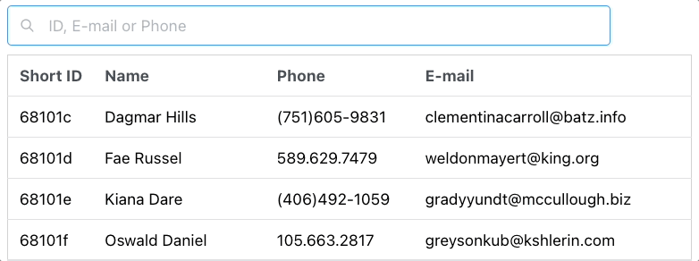

# React Fiber MongoDB
A simple fullstack app using
* **React** ([React-Query](https://react-query.tanstack.com/), [Mantine](https://mantine.dev/) for UI)
* **Go** ([Fiber](https://github.com/gofiber/fiber) for routing, [Qmgo](https://github.com/qiniu/qmgo) db-driver)
* **MongoDB**



A short post about it on [wahlstrand.dev](https://wahlstrand.dev/articles/2022-04-15-react-fiber-mongo/).


## How to run

**MongoDB**
```sh
docker run --name some-mongo -p 27017:27017 mongo
```

**Generate fake data**
```sh
(cd backend; go test -v -run Test_GenerateFakeData)
```

**Start backend**
```sh
(cd backend; go run .)
```

**Start frontend (separate terminal)**
```sh
(cd frontend; npm start)
```

Go to [localhost:3000](http://localhost:3000)
